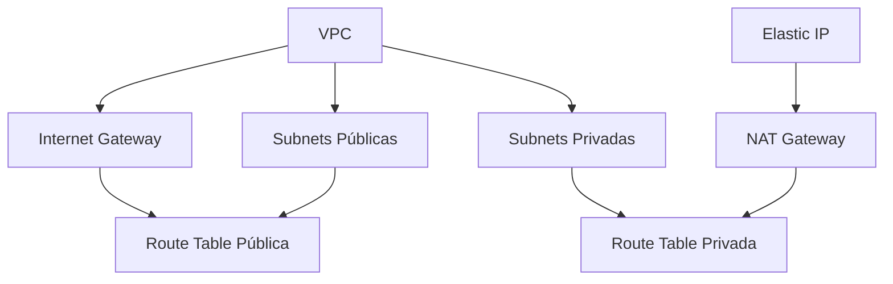

# 🌐 Módulo VPC

Este módulo implementa uma infraestrutura de rede completa e segura na AWS, seguindo as melhores práticas de arquitetura de rede.

## 📋 Visão Geral

O módulo VPC cria uma rede isolada com alta disponibilidade, incluindo subnets públicas e privadas distribuídas em múltiplas Availability Zones (AZs).

## 🏗️ Recursos Criados

### VPC
- CIDR: 10.0.0.0/16
- DNS hostnames habilitado
- DNS support habilitado
- Tags personalizadas por projeto

### Subnets
- **Públicas**
  - Distribuição em múltiplas AZs
  - IP público automático habilitado
  - CIDRs calculados automaticamente
  - Tags com identificação da AZ

- **Privadas**
  - Distribuição em múltiplas AZs
  - Sem IP público
  - CIDRs calculados automaticamente
  - Tags com identificação da AZ

### Internet Gateway
- Acesso à internet para subnets públicas
- Tags personalizadas por projeto
- Associação automática com a VPC

### NAT Gateway
- Acesso à internet para subnets privadas
- Elastic IP dedicado
- Alta disponibilidade
- Tags personalizadas por projeto

### Route Tables
- **Pública**
  - Rota padrão para Internet Gateway
  - Associação automática com subnets públicas

- **Privada**
  - Rota padrão para NAT Gateway
  - Associação automática com subnets privadas

## ⚙️ Variáveis

| Nome | Tipo | Descrição | Padrão | Obrigatório |
|------|------|-----------|--------|------------|
| `project_name` | string | Nome do projeto | - | Sim |
| `subnets_count` | number | Número de subnets públicas/privadas | - | Sim |

## 🔒 Segurança

### Isolamento de Rede
- Subnets privadas sem exposição direta à internet
- Controle granular de tráfego entre subnets
- Proteção contra acesso não autorizado

### Roteamento Seguro
- Subnets públicas: acesso direto à internet
- Subnets privadas: acesso à internet via NAT Gateway
- Rotas específicas para cada tipo de subnet

## 🔄 Dependências



## 🚀 Uso

```hcl
module "vpc" {
  source = "./modules/vpc"
  
  project_name = "meu-projeto"
  subnets_count = 3
}
```

## 📝 Outputs

| Nome | Descrição |
|------|-----------|
| `vpc_id` | ID da VPC criada |
| `public_subnets` | Lista de IDs das subnets públicas |
| `private_subnets` | Lista de IDs das subnets privadas |
| `nat_gateway_id` | ID do NAT Gateway |
| `public_route_table_id` | ID da Route Table pública |
| `private_route_table_id` | ID da Route Table privada |

## 🛠️ Manutenção

### Atualização
```bash
terraform plan
terraform apply
```

### Destruição
```bash
terraform destroy
```

## 📌 Notas Importantes

- O módulo é projetado para alta disponibilidade
- Todos os recursos são provisionados de forma idempotente
- As configurações seguem as melhores práticas da AWS
- O NAT Gateway é criado em uma subnet pública
- As subnets são distribuídas automaticamente entre as AZs disponíveis